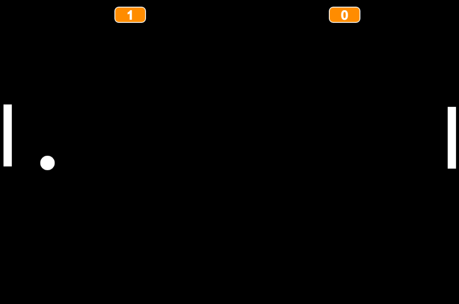

# Jogo Pong em JS - Curso Alura
Recriação do famoso jogo Pong em JavaScript no curso Lógica de Programação da Alura

  

No dia 19 de fevereiro de 2023, conclui o curso *Lógica de Programação: Comece em lógica com o jogo Pong e Javascript* da plataforma de cursos <a href="https://www.alura.com.br/" target="_blank">Alura</a>. No curso recriamos o famoso jogo Pong em JavaScript. Pong foi desenvolvido e publicado pela Atari em 1972.

Link do curso <a href="https://cursos.alura.com.br/course/pong-javascript/" target="_blank">aqui</a>.

## Tecnologias

* JavaScript
* <a href="https://p5js.org" target="_blank">P5 JS Editor</a>

## Bibliotecas utilizadas

* <a href="https://github.com/bmoren/p5.collide2D" target="_blank">p5.collide2D</a>

## Jogo

* Para jogar contra a máquina clique <a href="https://editor.p5js.org/lucsanro/full/wF_Blme8L" target="_blank">aqui</a>. Movimente sua raquete com as setas para CIMA e para BAIXO.

* Para jogar multiplayer clique <a href="https://editor.p5js.org/lucsanro/full/TgoQhz7Fy" target="_blank">aqui</a>. Movimente a raquete da esquerda com as teclas W e S e a raquete da direita com as teclas para CIMA e para BAIXO.

## Certificado

* Meu certificado [aqui](https://cursos.alura.com.br/certificate/fc68aecb-4b3c-4df7-a174-91713125304e).

