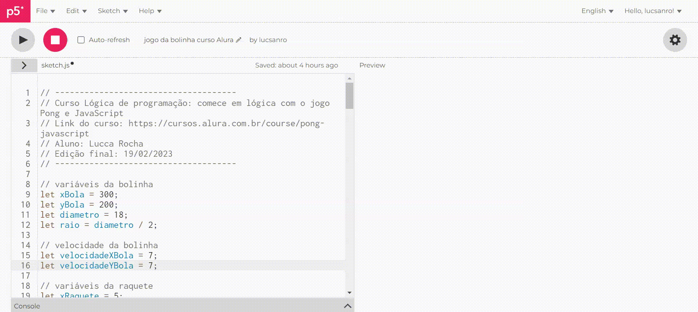

# Jogo Pong em JS - Curso Alura
Recriação do famoso jogo Pong em JavaScript no curso Lógica de Programação da Alura

No dia 19 de fevereiro de 2023, conclui o curso *Lógica de Programação: Comece em lógica com o jogo Pong e Javascript* da plataforma de cursos [Alura](https://www.alura.com.br/). No curso recriamos o famoso jogo Pong em JavaScript. Pong foi desenvolvido e publicado pela Atari em 1972.

Link do curso [aqui](https://cursos.alura.com.br/course/pong-javascript).

## Tecnologias

* JavaScript
* [P5 JS Editor](https://p5js.org/)

## Bibliotecas utilizadas

* [p5.collide2D](https://github.com/bmoren/p5.collide2D)

## Jogo

* Para jogar contra a máquina clique [aqui](https://editor.p5js.org/lucsanro/full/wF_Blme8L).

* Para jogar multiplayer clique [aqui](https://editor.p5js.org/lucsanro/full/TgoQhz7Fy).

  

